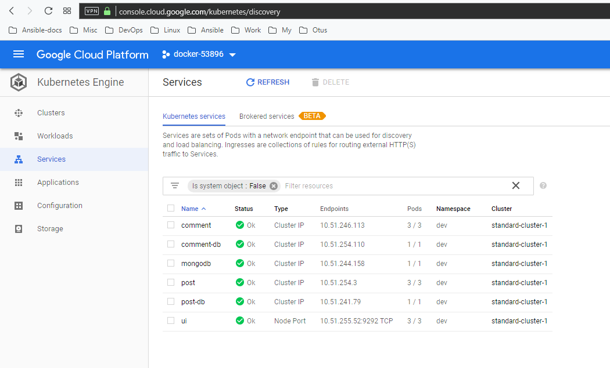

# alvicsam_microservices
alvicsam microservices repository

### hints

Исправление ошибки " Unable to query docker version: Get https://34.76.63.196:2376/v1.15/version: x509: certificate is valid for ip_addr, not other_ip_addr"  
`docker-machine regenerate-certs docker-host`

### ДЗ №12 Введение в Docker

Установлены Docker, docker-compose, docker-machine  
Запущен `docker run hello-world`  
Запущен `docker run -it ubuntu:16.04 /bin/bash` с созданием файла в одном из контейнеров и убедился, что он отсутствует в следующем
Найден старый контейнер `docker ps -a`  
Подключился к старому контейнеру `docker start 7dafa500cceb && docker attach 7dafa500cceb`  
Создал образ на основе этого контейнера `docker commit 7dafa500cceb alvic/ubuntu-tmp-file`  
Сохранил вывод команды docker images в файл docker-monolith/docker-1.log  

### ДЗ №13 Docker под капотом

Создан новый проект в gce с именем docker  
Экспортирована переменная с id проекта `export GOOGLE_PROJECT=docker-######`  
Создана вм в gcp с помощью docker-machine  
```bash
$ docker-machine create --driver google \
--google-machine-image https://www.googleapis.com/compute/v1/projects/ubuntu-os-cloud/global/images/family/ubuntu-1604-lts \
--google-machine-type n1-standard-1 \
--google-zone europe-north1-b \
docker-host
```
Добавлены Dockerfile и дополнительные файлы для создания образа  
Создан образ  
Запущен контейнер `docker run --name reddit -d --network=host reddit:latest`  
Разрешён входящий TCP-трафик на порт 9292:
```bash
$ gcloud compute firewall-rules create reddit-app \
--allow tcp:9292 \
--target-tags=docker-machine \
--description="Allow PUMA connections" \
--direction=INGRESS
```
Проверено, что приложение стало доступным  
Аутентифицирован на docker hub  
Образ помечен тегом `docker tag reddit:latest alvicsam/otus-reddit:1.0`  
Образ загружен в docker.hub `docker push alvicsam/otus-reddit:1.0`  
Загруженный контейнер запущен локально `docker run --name reddit -d -p 9292:9292 alvicsam/otus-reddit:1.0`  


### ДЗ №14 Docker. Микросервисы.

Скачан архив reddit-microservices и добавлены докерфайлы. ADD изменен на COPY.  
Запущена сборка контейнеров.  
```bash
docker build -t alvicsam/post:1.0 ./post-py
docker build -t alvicsam/comment:1.0 ./comment
docker build -t alvicsam/ui:1.0 ./ui
```
В процессе сборки исправлен Dockerfile для post-py (досталвяются недостающие пакеты)  
Создадна специальная сеть для приложения `docker network create reddit`  
Запущены контейнеры

```bash
docker run -d --network=reddit --network-alias=post_db --network-alias=comment_db mongo:latest
docker run -d --network=reddit --network-alias=post alvicsam/post:1.0
docker run -d --network=reddit --network-alias=comment alvicsam/comment:1.0
docker run -d --network=reddit -p 9292:9292 alvicsam/ui:1.0
```
Контейнер с ui пересобран новым Dockerfile  
Создан Docker volume `docker volume create reddit_db`  
Контейнеры запущены снова с учетом изменений:  
```bash
docker run -v reddit_db:/data/db -d --network=reddit --network-alias=post_db --network-alias=comment_db mongo:latest
docker run -d --network=reddit --network-alias=post alvicsam/post:1.0
docker run -d --network=reddit --network-alias=comment alvicsam/comment:1.0
docker run -d --network=reddit -p 9292:9292 alvicsam/ui:2.0
```

Проверена работа приложения

### ДЗ №15 Docker. Сети и Composer.

При запуске `docker run -ti --rm --network host joffotron/docker-net-tools -c ifconfig ` убедился, что присутствует только lo интерфейс  
При запуске `docker run --network host -d nginx` несколько раз убедился, что живет только один контейнер, т.к. использовался один и тот же сетевой namespace для докера и docker-machine. 
Запустился только первый контейнер, остальные - нет, т.к. 80 порт был занят.  
Выполнены команды:
```bash
alvic@alvic-nuc:~/DevOps/alvicsam_microservices$ docker-machine ssh docker-host 'sudo ln -s /var/run/docker/netns /var/run/netns'
alvic@alvic-nuc:~/DevOps/alvicsam_microservices$ docker-machine ssh docker-host 'sudo ip netns'                                                                                                                                                                                                                              default
alvic@alvic-nuc:~/DevOps/alvicsam_microservices$ docker-machine ssh docker-host 'sudo ip netns exec default ip addr'                                                                                                                                                                                                         1: lo: <LOOPBACK,UP,LOWER_UP> mtu 65536 qdisc noqueue state UNKNOWN group default qlen 1000
    link/loopback 00:00:00:00:00:00 brd 00:00:00:00:00:00
    inet 127.0.0.1/8 scope host lo
       valid_lft forever preferred_lft forever
    inet6 ::1/128 scope host
       valid_lft forever preferred_lft forever
2: ens4: <BROADCAST,MULTICAST,UP,LOWER_UP> mtu 1460 qdisc pfifo_fast state UP group default qlen 1000
    link/ether 42:01:0a:a6:00:02 brd ff:ff:ff:ff:ff:ff
    inet 10.166.0.2/32 brd 10.166.0.2 scope global ens4
       valid_lft forever preferred_lft forever
    inet6 fe80::4001:aff:fea6:2/64 scope link
       valid_lft forever preferred_lft forever
4: docker0: <NO-CARRIER,BROADCAST,MULTICAST,UP> mtu 1500 qdisc noqueue state DOWN group default
    link/ether 02:42:2f:88:ee:0c brd ff:ff:ff:ff:ff:ff
    inet 172.17.0.1/16 brd 172.17.255.255 scope global docker0
       valid_lft forever preferred_lft forever
```

Создал bridge-сеть `docker network create reddit --driver bridge`

Запустил контейнеры в сети reddit без алиасов и с ними. Без алиасов приложение не могло связаться с базой. Рабочий вариант:  
```bash
docker run -d --network=reddit --network-alias=post_db --network-alias=comment_db mongo:latest
docker run -d --network=reddit --network-alias=post alvicsam/post:1.0
docker run -d --network=reddit --network-alias=comment  alvicsam/comment:1.0
docker run -d --network=reddit -p 9292:9292 alvicsam/ui:1.0
```

В целях разделения сетей и изоляции бд были созданы сети:  
```bash
docker network create back_net --subnet=10.0.2.0/24
docker network create front_net --subnet=10.0.1.0/24
```

Запустил контейнеры:  
```bash
docker run -d --network=front_net -p 9292:9292 --name ui  alvicsam/ui:1.0
docker run -d --network=back_net --name comment  alvicsam/comment:1.0
docker run -d --network=back_net --name post  alvicsam/post:1.0
docker run -d --network=back_net --name mongo_db --network-alias=post_db --network-alias=comment_db mongo:latest
```

Т.к. у контейнера ui нет доступа к контейнерам comment и post их необходимо добавить в обе сети:  
```bash
docker network connect front_net post
docker network connect front_net comment
```

На docker-machine найдены bridge-интерейсы для двух сетей:
```bash
br-cad8c44c47c1 Link encap:Ethernet  HWaddr 02:42:db:1c:78:63
          inet addr:10.0.2.1  Bcast:10.0.2.255  Mask:255.255.255.0

br-f8b57c0e37ec Link encap:Ethernet  HWaddr 02:42:24:4f:3e:47
          inet addr:10.0.1.1  Bcast:10.0.1.255  Mask:255.255.255.0
```

И информация по одному из бриджей:  
```bash
docker-user@docker-host:~$ brctl show br-cad8c44c47c1
bridge name     bridge id               STP enabled     interfaces
br-cad8c44c47c1         8000.0242db1c7863       no              veth26b03f0
                                                        veth6263ef7
                                                        vethe44ac45
```

Правила iptables (правила в POSTROUTING - пускают контейнеры в инет, правило DNAT в DOCKER - натирует порт в порт для доступа снаружи), найден процесс docker-proxy, который слушает порт 9292:  
```bash
docker-user@docker-host:~$ sudo iptables -nL -t nat
...

Chain POSTROUTING (policy ACCEPT)
target     prot opt source               destination
MASQUERADE  all  --  10.0.1.0/24          0.0.0.0/0
MASQUERADE  all  --  10.0.2.0/24          0.0.0.0/0
MASQUERADE  all  --  172.17.0.0/16        0.0.0.0/0
MASQUERADE  all  --  172.18.0.0/16        0.0.0.0/0
MASQUERADE  tcp  --  10.0.1.2             10.0.1.2             tcp dpt:9292

Chain DOCKER (2 references)
...
DNAT       tcp  --  0.0.0.0/0            0.0.0.0/0            tcp dpt:9292 to:10.0.1.2:9292

docker-user@docker-host:~$ ps ax | grep docker-proxy
14455 ?        Sl     0:00 /usr/bin/docker-proxy -proto tcp -host-ip 0.0.0.0 -host-port 9292 -container-ip 10.0.1.2 -container-port 9292
```

Написан docker-compose.yml c параметрами, которые подтягиваются автоматически из файла .env (для этого необходимо запускать docker-compose в каталоге src). Также .env файл можно указать в файле композера директивой env_file.  
Имя проекта по умолчанию берется из названия директории, изменить можно если запускать ключом `-p имя_проекта`:  
```bash
user@comp:$ docker-compose -p awesomereedit up -d                                                                                                                                                                                                                                   Creating network "awesomereedit_front_net" with the default driver
Creating network "awesomereedit_back_net" with the default driver
Creating volume "awesomereedit_post_db" with default driver
Creating awesomereedit_ui_1      ... done
Creating awesomereedit_comment_1 ... done
Creating awesomereedit_post_db_1 ... done
Creating awesomereedit_post_1    ... done
```

### ДЗ 16 Gitlab и Gitlab-ci

Развернута вм для Gitlab, установлен Docker-CE, подготовлено окружение.  
Развернут Gitlab из docker-compose  
Создан проект, добавлен .gitlab-ci.yml, создан пайплайн, установлен контейнер с gitlab-runner, зарегистрирован gitlab-runner  
Добавлено приложение reddit с гитхаба express42  
Описаны dev, stage и production окружения  
Добавлены условия и ограничения  
Описано динамическое окружение  


### ДЗ 17 Мониторинг

Открыл правила фаервол на gcp:
```bash
gcloud compute firewall-rules create prometheus-default --allow tcp:9090
gcloud compute firewall-rules create puma-default --allow tcp:9292
```

Создал docker-host:
```bash
export GOOGLE_PROJECT=
docker-machine create --driver google --google-machine-image https://www.googleapis.com/compute/v1/projects/ubuntu-os-cloud/global/images/family/ubuntu-1604-lts --google-machine-type n1-standard-1 --google-zone europe-west1-b docker-host-new
eval $(docker-machine env docker-host-new)
```

Запустил Prometheus в докер-контейнере:
```bash
docker run --rm -p 9090:9090 -d --name prometheus prom/prometheus:v2.1.0 
```

В веб-интерфейсе получен build_info:  
`prometheus_build_info{branch="HEAD",goversion="go1.9.2",instance="localhost:9090",job="prometheus",revision="85f23d82a045d103ea7f3c89a91fba4a93e6367a",version="2.1.0"}    1`

Просмотрены метрики с адреса http://ip-of-prometheus-host:9090/metrics  
Перемещены файлы в директории docker и monitoring, из docker-compose упраны инструкции build  
Созданы файлы: Dockerfile для собственного контейнера prometheus, prometheus.yml с настройками  
Собран докер-образ: `docker build -t $USER_NAME/prometheus`  
Собраны образы: `for i in ui post-py comment; do cd src/$i; bash docker_build.sh; cd -; done`  
В docker-compose добавлен блок с prometheus  

После `docker-compose up -d` благодоря prometheus обнаружил, что приложение работает некорректно - не работал блок комментариев. Переделал docker-compose.yml (добавил алиасы для сетей)  
В docker-compose добавлен node-exporter, также добавлен job в prometheus.yml, пересобран контейнер с prometheus.  
Зашел по ssh на докер хост, создал нагрузку на CPU командой `yes > /dev/null`, убедился, что Prometheus работает (график node_load1)  
Запушил образы на докерхаб:
```bash
docker push $USER_NAME/ui
docker push $USER_NAME/comment
docker push $USER_NAME/post
docker push $USER_NAME/prometheus
```

Увидеть можно здесь: https://hub.docker.com/u/alvicsam

### ДЗ 18 Логирование

Создал docker-machine:

```bash
docker-machine create --driver google \
 --google-machine-image https://www.googleapis.com/compute/v1/projects/ubuntu-os-cloud/global/images/family/ubuntu-1604-lts \
 --google-machine-type n1-standard-1 \
 --google-open-port 5601/tcp \
 --google-open-port 9292/tcp \
 --google-open-port 9411/tcp \
 logging 
```

Создал docker-compose-logging.yml  
Указал версию для elasticsearch и kibana, т.к. latest не запускается  
Создал Dockerfile для контейнера fluentd и собрал контейнер  
Добавил логирование в контейнер post  
Зашел в docker-machine и поменял параметр ядра, чтобы elasticsearch заработал:
```bash
docker-machine ssh logging
sysctl -w vm.max_map_count=262144
```
Запустил `docker-compose -f docker-compose-logging.yml up -d`  
Создал несколько записей и комментов, зашёл в Kibana и увидел логи  
Добавил фильтр парсинга json в fluent.conf, пересобрал контейнер, перезапустил docker compose:
```bash
docker build -t $USERNAME/fluentd .
docker-compose -f docker-compose-logging.yml up -d fluentd
```
Обновил field list в Management -> Kibana Index Patterns, убедился, что json парсится  
Добавил логирование для контейнера ui в docker-compose, перезапустил его  
Во fluent.conf добавил фильтр с регуляркой для ui, пересобрал, перезапустил контейнер  
Изменил регулярку на grok, пересобрал ui, убедился, что сообщение парсится  


### ДЗ 20 kubernetes-2

Установлен kubectl:

```bash
sudo apt-get update && sudo apt-get install -y apt-transport-https
curl -s https://packages.cloud.google.com/apt/doc/apt-key.gpg | sudo apt-key add -
echo "deb https://apt.kubernetes.io/ kubernetes-xenial main" | sudo tee -a /etc/apt/sources.list.d/kubernetes.list
sudo apt-get update
sudo apt-get install -y kubectl
```

Установлен minikube:
```bash
curl -Lo minikube https://storage.googleapis.com/minikube/releases/v0.27.0/minikube-linux-amd64 && chmod +x minikube && sudo mv minikube /usr/local/bin/
```

Запущен minikube и проверен:
```bash
$minikube start 
$kubectl get nodes
NAME       STATUS   ROLES    AGE   VERSION
minikube   Ready    master   1m    v1.10.0
```

Добавлен ресурс ./kubernetes/reddit/ui-deployment.yml  
Запущены:
```bash
#Применение деплоймента
 $ kubectl apply -f ui-deployment.yml
deployment.apps/ui created
# Проверка деплоймента
 $ kubectl get deployment
NAME   DESIRED   CURRENT   UP-TO-DATE   AVAILABLE   AGE
ui     3         3         3            0           16s
# Проверка, что pod'ы создались
 $ kubectl get pods --selector component=ui
NAME                  READY   STATUS    RESTARTS   AGE
ui-6b5984885c-89mjl   1/1     Running   0          2m
ui-6b5984885c-98xd9   1/1     Running   0          2m
ui-6b5984885c-f4xv5   1/1     Running   0          2m
```

Проброшен порт: `kubectl port-forward ui-6b5984885c-89mjl 8080:9292`  
Проверил, что приложение по адресу http://127.0.0.1:8080 открылось  
Провернул вышеописанное с comment-deployment.yml, проверил по адресу http://localhost:8080/healthcheck:
```bash
$ curl http://localhost:8080/healthcheck
{"status":0,"dependent_services":{"commentdb":0},"version":"0.0.3"}
```
Провернул вышеописанное с post-deployment.yml, проверил по адресу http://localhost:8080/healthcheck:
```bash
$ curl http://localhost:8080/healthcheck
{"status": 0, "dependent_services": {"postdb": 0}, "version": "0.0.2"}
```
Аналогичным обарзом запущен pod с mongo  
Созданы объекты Service для набора POD-ов и способов доступа к ним (comment-service и post-service).  
Проверка:
```bash
$ kubectl describe service comment | grep Endpoints
Endpoints:         172.17.0.7:9292,172.17.0.8:9292,172.17.0.9:9292
$ kubectl describe service post | grep Endpoints
Endpoints:         172.17.0.10:5000,172.17.0.11:5000,172.17.0.12:5000
$ kubectl exec -ti post-7d77cfc4d9-9cfbb nslookup comment
nslookup: can't resolve '(null)': Name does not resolve

Name:      comment
Address 1: 10.106.230.40 comment.default.svc.cluster.local
```
По аналогии создан сервис mongodb  
При попытке зайти на http://localhost:9292 получили ошибку, т.к. микросервисы коннектятся к бд под разными именами  
Обновил файлы comment-deployment.yml, mongo-deployment.yml, post-deployment.yml  
Создал comment-mongodb-service.yml, post-mongodb-service.yml - сервисы для БД comment и post 
Применил конфигурацию и убедился, что приложение работает  

Удалил объект mongodb-service.yml `kubectl delete -f mongodb-service.yml`
Создал сервис ui-service.yml и применил конфигурацию  
Зашел через `minikube service ui` и убедился, что приложение работает  
Посмотрел сервис лист:
```bash
$ minikube service list
|-------------|----------------------|-----------------------------|
|  NAMESPACE  |         NAME         |             URL             |
|-------------|----------------------|-----------------------------|
| default     | comment              | No node port                |
| default     | comment-db           | No node port                |
| default     | kubernetes           | No node port                |
| default     | post                 | No node port                |
| default     | post-db              | No node port                |
| default     | ui                   | http://192.168.99.100:32092 |
| kube-system | kube-dns             | No node port                |
| kube-system | kubernetes-dashboard | http://192.168.99.100:30000 |
|-------------|----------------------|-----------------------------|
```

Создал dev-namespace  
Запустил в нём приложение: `kubectl apply -n dev -f .` и проверил, что всё работает `minikube service ui -n dev`  
Добавил информацию об окружении в ui-deployment.yml (секция env в spec), применил `kubectl apply -f ui-deployment.yml -n dev` и убедился что в ui появилось слово dev  


Запустил приложение в GKE:
```bash
$ gcloud container clusters get-credentials standard-cluster-1 --zone europe-west2-a --project docker-5
Fetching cluster endpoint and auth data.
kubeconfig entry generated for standard-cluster-1.
$ kubectl config current-context
gke_docker-53896_europe-west2-a_standard-cluster-1
$ kubectl apply -f ./kubernetes/reddit/dev-namespace.yml
namespace/dev created
$ kubectl apply -f ./kubernetes/reddit/ -n dev
deployment.apps/comment created
service/comment-db created
service/comment created
namespace/dev unchanged
deployment.apps/mongo created
service/mongodb created
deployment.apps/post created
service/post-db created
service/post created
deployment.apps/ui created
service/ui created
$ kubectl get nodes -o wide
NAME                                                STATUS   ROLES    AGE   VERSION          INTERNAL-IP   EXTERNAL-IP      OS-IMAGE                             KERNEL-VERSION   CONTAINER-RUNTIME
gke-standard-cluster-1-default-pool-3aacd640-0rx6   Ready    <none>   5m    v1.11.7-gke.12   10.154.0.3    35.242.181.106   Container-Optimized OS from Google   4.14.91+         docker://17.3.2
gke-standard-cluster-1-default-pool-3aacd640-159c   Ready    <none>   4m    v1.11.7-gke.12   10.154.0.2    35.242.185.35    Container-Optimized OS from Google   4.14.91+         docker://17.3.2
$ kubectl describe service ui -n dev | grep NodePort
Type:                     NodePort
NodePort:                 <unset>  31574/TCP
$ curl http://35.242.185.35:31574 | grep dev
<a class='navbar-brand' href='/'>Microservices Reddit in dev ui-5d65bf8d9b-pd6dw container</a>
```



